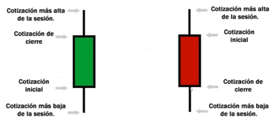

# Criptomoneda

Referencias sobre inversión en criptomonedas y tecnología blockchain.

Información inicial con base al *Curso de Inversión en Criptomonedas* de platzi.com.

## Tabla de contenido

- [Bitcoin](#Bitcoin).
- [Blockchain](#Blockchain).
- [Criptomonedas o criptoactivos](#Criptomonedas-o-criptoactivos).
- [Blockchain 1.0, 2.0, 3.0](#Blockchain-1.0,-2.0,-3.0)
- [Blockchain pública, privada, semi-privada y consorcio](#Blockchain-pública,-privada,-semi-privada-y-consorcio).
- [Comprar bitcoin](#Comprar-bitcoin).
- [Wallet](#Wallet).
- [De dinero a criptomoneda y viceversa](#De-dinero-a-criptomoneda-y-viceversa).
- [Categorias de criptoactivos e ICOs](#Categorias-de-criptoactivos-e-ICOs).
- [Criptografia simétrica y asimétrica](#Criptografia-simétrica-y-asimétrica).
- [Las funciones Hash](#Las-funciones-Hash).
- [Diferencia entre criptomoneda y token](#Diferencia-entre-criptomoneda-y-token).
- [Minería, mecanismos de consenso y PoW](#Minería,-mecanismos-de-consenso-y-PoW).
- [Pools de Minería](#Pools-de-Minería).
- [Mecanismos de consenso PoS](#Mecanismos-de-consenso-PoS).
- [Masternodos](#Masternodos).
- [Desarrollos sobre Blockchain](#Desarrollos-sobre-Blockchain).
- [ICO, DAICO, ITO](#ICO,-DAICO,-ITO).
- [Portafolios de inversión](#Portafolios-de-inversión).
- [Encontrar ICOs](#Encontrar-ICOs).
- [Coinmarketcap](#Coinmarketcap).
- [Telegram: Grupos y canales](#Telegram:-Grupos-y-canales).
- [Airdrops y Bounties](#Airdrops-y-Bounties).
- [Hardforks](#Hardforks).
- [Estafas, pirámides y esquemas Ponzi](#Estafas,-pirámides-y-esquemas-Ponzi).
- [Trading](#Trading).
- [Exchanges o casas de cambio](#Exchanges-o-casas-de-cambio).
- [Órdenes de compra y venta](#Órdenes-de-compra-y-venta).
- [Introducción al Análisis Técnico](#Introducción-al-Análisis-Técnico).
- [Análisis técnico](#Análisis-técnico).
- [Retroceso Fibonacci](#Retroceso-Fibonacci).
- [Margintrading, Short, long](#Margintrading,-Short,-long).
- [Tipos de Trading. Pump and Dump](#Tipos-de-Trading.-Pump-and-Dump).
- [Glosario de términos](#Glosario-de-términos).

## Bitcoin

Bitcoin fue creado en el 2008 por Satoshi Nakamoto. Bitcoin es la primera moneda digital descentralizada, que puede enviarse a travez de internet de persona a persona, por medio de la red basada en peer-to-peer ([P2P](https://es.wikipedia.org/wiki/Peer-to-peer)), sin un intermediario bancario.

Cada moneda bitcoin puede subdividirse en cantidades más pequeñas, hasta llegar a los ocho decimales. La unidad más pequeña en la que se puede subdividir un bitcoin es en cien millonésimas de bitcoin, es decir, 0,00000001 bitcoins. Esta unidad es conocida como satoshi, en honor a Satoshi Nakamoto. 

**Características**

- No permite el doble gasto: significa que no se puede copiar o falsificar.
- Sin riesgo de terceros.
- Costo insignificante.
- Veloz.
- Sin derecho de admisión.
- Internacional.
- Sin confiscación posible.
- Limitado a 21 millones de bitcoins.

## Blockchain

La cadena de bloques o "blockchain", es una contabilidad pública compartida en la que se basa toda la red Bitcoin. Todas las transacciones confirmadas se incluyen en la cadena de bloques. De esta manera los monederos Bitcoin pueden calcular su saldo gastable y las nuevas transacciones pueden ser verificadas, asegurando que el cobro se esta haciendo al que realiza el pago. La integridad y el orden cronológico de la cadena de bloques se hacen cumplir con criptografía.

Blockchain hace parte de un conjunto de Tecnología de Registro Distribuido (DLTs). Es la estructura que hay detrás de las mayoría de criptomonedas, en este caso Bitcoin. Las DLTs, son miles de nodos auditandose entre ellos, para asegurar que tengan el mismo libro contable de todas las transacciones de Bitcoin.

Por lo anterior, Blockchain es una DLTs, pero DLTs no es blockchain.

**Características**

- Distribuido.
- Concenso.
- Global.
- Velocidad.
- Funciona a base de criptografía.
- Transparente.
- Inmutable.
- Sin intermediarios.

## Criptomonedas o criptoactivos

Muchas de las criptomonedas no están pensadas para ser usadas como monedas, como sí es el caso de Bitcoin, en su lugar están pensadas para ser usadas con otras funciones como: en el desarrollo de aplicaciones, para hacer una red social o para almacenar datos en la blockchain, entre otras cosas. Es por esta razón que es preferible llamarlas **criptoactivos**.

Todas las criptomonedas diferentes a Bitcoin, son conocidas como **alternative coins** o **ALTCOINS** (monedas alternativas).

La segunda criptomoneda más importante se llama **Ethereum**, actualmente es la segunda porque tiene la mayor capitalización después de Bitcoin.

Ethereum fue creada en 2014 por Vitalik Buterin, un ex desarrollador de Bitcoin que introdujo los **contratos inteligentes** o **smart-contracts** en la tecnología blockchain.

Un smart contract es como un contrato tradicional de los que se usan para establecer acuerdos entre dos o más personas pero que en lugar de recurrir a una tercera persona como un notario para garantizar su cumplimiento, recurre a la blockchain como garantía de confianza distribuida para ejecutar lo acordado.

## Blockchain 1.0, 2.0, 3.0

La red Bitcoin es lo que se conoce como **Blockchain 1.0** usada principalmente para enviar y recibir transacciones de valor. Es capaz de procesar alrededor de 5 transacciones por minuto.

Cuando nació la red Ethereum empezamos a hablar de un nuevo termino llamado **Blockchain 2.0**, lo que incorpora la utilización de smart contracts, la cual es una blockchain en la que se pueden hacer desarrollos [DApps](https://www.bbva.com/es/que-son-las-dapps-y-por-que-seran-cada-vez-mas-importantes/). Procesa cerca de 25 transacciones por minuto.

Por su parte la **Blockchain 3.0** es un nuevo enfoque de criptomonedas cuya principal propuesta es mejorar la escalabilidad de sus aplicaciones, e incorporar nuevas características de utilización como apostilla de datos, sistemas de votaciones, etc. Es capaz de procesar entre 2000 y 4000 operaciones por minuto. EOS, ARK y NEM son conocidas por estar creadas como Blockchain 3.0

## Blockchain pública, privada, semi-privada y consorcio

Hay 4 tipos de redes de Blockchain:

- Pública: Es una red blockchain a la que cualquiera puede tener acceso.
- Privada: Blockchain implementada en una empresa u organización para aprovechar todas sus características mediante uso interno.
- Semi-Privada: : Implementación privada con acceso parcial a una blockchain pública o a personas especificas externas.
- Consorcio: Es un conjunto de blockchains privadas distribuidas en diferentes empresas con acceso entre ellas.

## Comprar bitcoin

Antes que nada debes tener mucho cuidado al acceder a sitios para comprar o vender bitcoins o criptoactivos en general, ya que podrías encontrar páginas falsas en las cuales te piden tus datos o te hacen crear una cuenta y enviar dinero pero que en realidad terminan siendo una estafa. Sólo accede a sitios verificados y seguros.

[LocalBitcoins.com](https://LocalBitcoins.com) es una de estas páginas que te permite entrar en contacto con otras personas que también son usuarios registrados y que están dispuestos a comprar o vender bitcoins. Funciona como intermediaria o tercero de confianza en las transacciones con bitcoin mediante el modelo de "escrow" (o resguardo del monto en tránsito) y para ello cobra una comisión. Sólo opera con Bitcoins.

En LocalBitcoins se pueden realizar operaciones de compra y venta de bitcoins con diferentes medios de pago como: Efectivo (USD, Pesos mexicanos, etc.), transferencias a bancos locales, transacciones electrónicas con Paypal, Payeer, Payza, Payoneer, y muchos otros.

Otras páginas seguras en las que puedes comprar y vender bitcoins (y algunas otras altcoins) son:

- [https://uphold.com/](https://uphold.com/)
- [https://bitso.com/](https://bitso.com/)
- [https://www.buda.com/](https://www.buda.com/)
- [https://panda.exchange/](https://panda.exchange/)
- [https://coinmonitor.info/](https://coinmonitor.info/)
- [https://www.bitinka.com/](https://www.bitinka.com/)
- [https://Changelly.com/?ref_id=c936805df4e6](https://Changelly.com/?ref_id=c936805df4e6)
- [https://www.coinbase.com/](https://www.coinbase.com/)

Recomendación: Siempre usa sitios verificados y seguros, y recuerda, por seguridad, evitar las transacciones de intercambio en efectivo y en persona, y revisa siempre la reputación de los usuarios con los que realizas tus transacciones.

## Wallet

Una cartera, monedero o wallet es un software que almacena claves privadas necesarias para acceder a los saldos almacenados en una cadena de bloques (blockchain). Esto significa que la cartera es la interfaz a través de la cual se envían y reciben criptomonedas. Y esta interfaz está al alcance del usuario las 24 horas del día, sin importar horarios de trabajo o días festivos. Cada criptousuario es su propio banco.

Algunas de las carteras más recomendadas:

- [Samuourai Wallet](https://samouraiwallet.com/) única para Bitcoin y funciona sólo en Android.
- [Mycelium](https://mycelium.com/) disponible para iOS y Android.
- [Copay](http://copay.io) esta disponible para todos los sistemas operativos. Funciona con Bitcoin y Bitcoin Cash.
- [Jaxx](https://jaxx.io/) es una multiwallet para diversas criptomonedas. Tiene versión móvil y de escritorio.

## De dinero a criptomoneda y viceversa

**Tengo dinero y quiero comprar Bitcoins**

1. Ingresar a una de las páginas que permite comprar y vender Bitcoins, como [LocalBitcoins.com](https://LocalBitcoins.com). 
2. Realizar la transacción a la entidad que solicita el vendedor.
3. Después de confirmar la transacción, los Bitcoins quedarán en la cartera de LocalBitcoins.
4. Trasladar los Bitcoins a una cartera personal.

**Tengo Bitcoins y quiero vender**

1. Trasladar el saldo de Bitcoins que desea vender, desde la cartera personal a la cartera de LocalBitcoins.
2. Colocar un anuncio de venta.
3. Esperar que un comprador realice la transacción del pago a la cuenta que usted solicite.
4. Después de confirmar la transacción, liberar los Bitcoins al comprador.

Para ambos escenarios, plataformas como LocalBitcoins.com, utiliza un sistema de garantía, el cual se le conoce como el método **escrow**. Básicamente, el escrow es un contrato de depósito en garantía en el que el dinero queda en reserva a través de un tercero (como LocalBitcoins), el cual se encargará de liberar los Bitcoins cuando el vendedor ha confirmado la transferencia del dinero con éxito. Por el contrario, si el vendedor no libera los Bitcoins, el tercero lo hará por él, asegurando al comprador sus Bitcoins por los que ha pagado. Para lo anterior, LocalBitcoins cobra una baja comisión por dicho proceso.

## Categorias de criptoactivos e ICOs

Algunos tipos de criptoactivos:

**Currency / Criptomonedas** 

Están pensadas como monedas de intercambio, para enviar y recibir valor, para suplantar de alguna manera al dinero tradicional que conocemos. Algunos ejemplos son: Bitcoin, Litecoin, Dash y Bcash entre otras.

**Pirvate Currency / Criptomonedas privadas** 

Son similares al tipo anterior pero están enfocadas en resguardar la privacidad, en mantener el anonimato. Por ejemplo: Zcash, Monero, PIVX y Navcoin.

**Social** 

Están pensadas como medios de remuneración en redes sociales, de hecho su plataforma funciona como una red social basada en Blockchain. Por ejemplo: Steem, Status y ReddCoin.

**Desarrollo**

Son criptoactivos enfocados en ser aplicaciones que funcionan sobre la base de redes blockchain. Por ejemplo: Ethereum, Icon, EOS, Qtum, NEM entre otros.

**Almacenamiento** 

Hay criptoactivos o token enfocados en funcionar como formas de almacenamiento basado en Blockchain. Por ejemplo: SIA, Filecoin y Storj.

**Internet of Things**

Están pensadas para facilitar transacciones de intercambio entre dispositivos que funcionan con tecnología IoT. Por ejemplo: IOTA e IOT Chain.

**ICO** 

ICO del inglés Initial Coin Offering (oferta inicial de dinero), es un modelo de recaudación de dinero, en el que un grupo de personas que inician un proyecto buscan financiamiento mediante la generación y venta de una criptomoneda particular. Cualquier persona alrededor del mundo puede crear y/o participar en ICOs.

**ITOs** 

ITOs del inglés Initial Token Offering, es un modelo de recaudación igual al anterior pero en lugar de enfocarlo en la creación de criptomonedas, se basa en tokens, que no están pensados para su uso como dinero.

**DAICO**

DAICO, es un modelo de inversión creado por *Vitalik Buterin*, en el que un grupo de accionistas que adquieren tokens o criptomonedas para financiar a un grupo de proyecto, tienen derecho a voto y participación en la toma de decisiones sobre la operación del proyecto.

## Criptografia simétrica y asimétrica

La palabra Criptografía proviene del griego "kryptos" que significa oculto, y "graphia", que significa escritura, y su definición según el dicccionario es "Arte de escribir con clave secreta o de un modo enigmático". La Criptografía es una técnica, o más bien un conjunto de técnicas, que originalmente tratan sobre la protección o el ocultamiento de la información frente a observadores no autorizados. Entre las disciplinas que engloba cabe destacar la Teoría de la Información, la Complejidad Algorítmica y la Teoría de números o Matemática Discreta, que como ya sabemos estudia las propiedades de los números enteros.

Existen dos tipos de algoritmos criptográficos modernos:

**Criptografia simétrica**

Es ocultar cualquier dato dentro de un algoritmo cifrado con el cual el emisor puede enviar el mensaje oculto y la parte receptora tiene que tener el mismo algoritmo de cifrado y utilizarlo a la inversa. Si alguien en medio logra tener acceso a ese algoritmo criptográfico puede desencriptarlo sin problema.

La clave de cifrado y descifrado que genera el algoritmo, es la misma.

**Criptografia asimétrica**

A diferencia de la simétrica, el algoritmo de cifrado asimétrico, genera dos llaves distintas, las cuales son conocidas como clave pública y clave privada. Generalmente, la clave pública la utiliza el emisor para cifrar el archivo y solo con la clave privada del receptor podrá descifrar el archivo. El proceso de cifrado anterior, puede ser a la inversa, donde el emisor puede cifrar con la clave privada y cualquier receptor con la llave pública podrá descifrar el archivo. Lo anterior, no genera confidencialidad, pero su contenido será auténtico por su emisor esperado.

Entre estos tipos de algoritmos se complementan, ya que se usan esquemas de seguridad híbridos, los cuales implementan ambos tipos para generar mayor seguridad.

Las criptomonedas utilizan el sistema de cifrado asimétrico, el cual generan una dirección que puedes compartir con todo el mundo y una llave privada con la que tienes acceso a los fondos y se debe cuidar muy bien. Algunas wallet generan algo que se conoce como “seed” o “semilla” y generan 12 o 24 palabras. Lo anterior, es para no tener que anotar la llave privada en su estado puro sino un poco más amigable y así poder resguardar mejor con menos probabilidad de equivocarse.

## Las funciones Hash

Una función hash es la generación de una huella digital de cualquier dato de información que lo vuelve único. A partir del resultado de un hash no puedo determinar cómo fue creado. Piénsalo como ese plato ya hecho pero del cual no conozco la receta exacta ni cada ingrediente. También funciona como un sistema de autenticación. 

En la minería de criptomonedas se utiliza el hash con el algoritmo SHA256.

Esta [página web](https://anders.com/blockchain/hash.html), permite generar hash con el algoritmo SHA256 para una información que ingrese el usuario, como por ejemplo, tu nombre.

## Diferencia entre criptomoneda y token

**Criptomoneda**

- Una criptomoneda tiene su propia blockchain.
-Tienen su propio sistema de minería
- Tienen una función específica.

**Token**

- Un token es cualquier forma de digitalización de un activo.
- Los token no se pueden minar, a diferencia de las criptomonedas.
- El ERC20 es uno de los tokens mas populares.

Un token globalmente es la digitalización de cualquier activo. El ERC20 es un smartcontract basado en Ethereum y es el token más popular entre las ICOs o representaciones de acciones de un proyecto. Estos tokens funcionan sobre una blockchain ya existente.

Más información, dando clic [aquí](https://academy.bit2me.com/que-es-un-token/).

## Minería, mecanismos de consenso y PoW

El concepto de minería viene de su similitud con la minería tradicional, de la extracción de minerales o metales preciosos y del esfuerzo que ello requiere, y la necesidad de usar maquinaria especializada. Así funcionan los computadores especializados llamados mineros.

Un nodo, es un servidor que tiene una copia completa de toda la blockchain. En un sistema de minería los nodos no se conocen haciendo la red más segura. También se encarga de validar las transacciones. Los mineros son personas o dispositivos que hacen las veces de notarios o validadores.

Diferencias entre nodo completo y Minero: Un nodo valida las operaciones en la red, pero sólo el minero puede ganarse la recompensa.

El primero de los sistemas de consenso es PoW ó Proof of Work.

En [este vídeo](https://www.youtube.com/watch?v=YBNr69vrscw), explican como funciona la mineria de Bitcoin, recompensa por minar y el sistema de consenso Proof of Work.

## Pools de Minería

Las Pools de minería son grupos de personas que se unen o se asocian usando su(s) equipo(s) de minería individual(es) con el propósito de formar granjas virtuales de minería, y así tener mayor poder de procesamiento en conjunto que pueda competir con otras granjas o equipos mineros muy potentes por la recompensa en el procesamiento de transacciones de una blockchain.

Si llegara a darse el caso de que una Pool de minería tenga en su conjunto 51% o más del poder de procesamiento de toda la red blockchain en la que se encuentra, se correría el riesgo de lo que se conoce como un Ataque del 51%, en el que los administradores de esta pool tendrían el poder de manipular las transacciones a su antojo, pudiendo generar dobles gastos, invalidando y aprobando confirmaciones de bloques, entre otros.

## Mecanismos de consenso PoS

PoS o Proof of Stake es un sistema de consenso o una forma de minería basada en Prueba de Participación a diferencia de la más común basada en Prueba de Trabajo o Proof of Work (PoW). PoS es mucho más sencilla de llevar a cabo y la rentabilidad puede ser también muy buena. El objetivo principal de este tipo de minería es que sea menos costosa y que consuma muchos menos recursos de electricidad, espacio físico, refrigeración, etc.

A diferencia de la minería PoW en la que se compite por una recompensa mediante el uso del poder de cómputo (generalmente medidos en THS o GHS) para validar bloques en la cadena blockchain, en PoS lo que determina la capacidad necesaria para validar los bloques de la red, es la cantidad de criptoactivos ó criptomonedas que se poseen, que se tienen acumulados, así pues, el minero que tiene más monedas acumuladas y que pueda dejarlas retenidas en garantía para la validación de bloques, tiene mayor probabilidad de recibir recompensa.

Existen dos tipos de minería Proof of Stake:

**PoS (estándard)**

En el que cada minero deja en garantía una cantidad de monedas para facilitar la validación de bloques. Por ejemplo: NEO, NEXT, PVIX.

**DPoS (Delegate Proof of Stake)** 

Además de la acumulación de monedas, requiere que un grupo de nodos, mediante sistema de votación, se eligen los nodos que validarán los bloques. Así funcionan: EOS, ARK y Lisk.

**PoI (Proof of Importance)** 

Es el sistema de consenso empleado por la red NEM, y se basa en la reputación o historial de transacciones realizadas por cada nodo sobre la blockchain. A mejor reputación, mayor probabilidad para validar bloques.

**Casper**

Es un sistema híbrido de Ethereum que mezcla PoW con PoS y para poder ser un nodo de esta red se requiere una cantidad importante de dinero puesta en garantía para aspirar a la validación de bloques.

## Masternodos

Masternode es una de las posibilidades para obtener rentabilidad del mundo de las criptomonedas.

Los Masternodes son un tipo de nodo completo que ofrecen varios servicios a la red y son recompensados ​​por ello. Como todos los nodos completos, los masternodes tienen una copia completa del **Blockchain**. Sin embargo, los masternodes difieren de los nodos completos ordinarios en algunos aspectos importantes. Más allá del simple envío y validación de transacciones, los masternodes realizan funciones avanzadas para la red:

- Aumentar la privacidad de las transacciones.
- Hacer transacciones instantáneas.
- Participar en la gobernanza y la votación.
- Habilitar presupuesto y sistema de tesorería en criptos.

Cualquier persona puede ejecutar un masternode. Sin embargo, existe una barrera de entrada para garantizar que el sistema no se vuelva malicioso, **poseer un cierto número de monedas**.

La cantidad requerida difiere para cada moneda y sirve como garantía para prevenir los ataques Sybil en la red, lo que la vuelve necesaria. Sin esta garantía, no sería complicado que el dueño de un masternode engañase o corrompese el sistema creando numerosos masternodes e interfiriendo en las operaciones de red.  De esta forma los operadores de los masternodes tiene algo en juego durante toda la partida.

**Retorno de la inversión**

Los masternodes son compensados ​​por sus servicios a través de la red, lo que incentiva a los inversores de criptomonedas a ejecutar un masternode.

Esta recompensa varía entre criptomonedas. Con Dash, la criptomoneda que creo esta innovación y la puso en funcionamiento, la recompensa de la minería se divide de manera que el 45% de la recompensa vaya a los masternodes, el 10% a un fondo de desarrollo y el 45% al minero que encontró el bloque.

Ver la fuente de esta nota dando clic [aquí](https://bitcoin.es/noticias/que-es-un-masternode-criptoinversores-presten-atencion/).

## Desarrollos sobre Blockchain

Otro modelo de negocio ó desarrollo sobre Blockchain, conocido como DApp o Descentralized application el  cual consiste en poner las características de descentralización de las criptomonedas y aplicarlo a cualquier aplicación. Puedes crear hasta juegos y dejarlo sobre una blockchain, como por ejemplo, [Cryptokitties](https://www.cryptokitties.co/) o [Fishbank](https://fishbank.io/n/?r=1).

Los CryptoKitties son mascotas virtuales que se deben alimentar. Estas son **smart contracts** que funcionan sobre la blockchain de Ethereum. Cada gatito es único, y puede llegar a ser muy costoso.

Fishbank es un juego de unos peces que se alimentan y juegan por el mar. Este también funciona sobre la blockchain de Ethereum como un **smart contract**.

**Otras DApps**

- Civic es como un documento de identidad del futuro. Funciona sobre la blockchain de Ethereum y es un token. Quiere protegerte contra el robo de identidad.
- Status es un token sobre la blockchain de ethereum, un conjunto de smartcontracts y es como un whatsapp. Te permite hacer pagos a través de un chat.
- Golem es un token de Ethereum. Busca que al ser parte de un nodo, puedas alquilar poder de cómputo. Puedes alquilar capacidad de RAM, de almacenamiento, entre otros.
- Subtratum es un token de Ethereum y busca ser el internet descentralizado.
 
La mayoría de estas DApps, se basan en la blockchain 2.0, son de código abierto y permiten que las personas puedan invertir en el proyecto, comprando tokens, como sucede con Civic y Status.

## ICO, DAICO, ITO

- ICO: Initial Coin Offering. El concepto de ICO es la recaudación.
- DAICO: Decentralized Autonomous Initial Coin Offering. Los que tienen el poder cuando emites los tokens son los mismos inversionistas.
- ITO: Initial Token Offering. Emitir tokens o smart contracts. El concepto de ITO es sobre la creación de tokens.

## Portafolios de inversión

Según Forbes, si Bitcoin fuera una empresa, de acuerdo a su capitalización actual de mercado, sería más grande que empresas como Walt Disney, Mc Donalds, General Electric, Procter & Gamble y Visa, entre otros. De hecho Bitcoin creció tanto en 2017, que su capitalización fue mayor que el PIB de muchos países de latinoamérica como: Chile, Venezuela, Perú, Costa Rica y Panamá, entre otros.

En este momento ya hay un capital importante dentro de las criptomonedas. Hay mucha gente invirtiendo, hay mucha gente capacitándose, creando portafolios de inversión de altísimo rendimiento incluso famosos como: Bill Gates, Richard Branson, Lionel Messi, James Rodriguez, Mike Tyson y otros, ya conocen sobre criptomonedas y están haciendo sus inversiones.

En 2017 el crecimiento de Bitcoin fue de más de 1000%, y no fue la de mayor rentabilidad, criptomonedas como Ripple, NEM y Stellar tuvieron rendimientos de entre 25 mil y 40 mil %, la de mayor crecimiento fue una criptomoneda hasta entonces desconocida, llamada Verge con un cambio de más de 800.000%.

En promedio, el retorno por la inversión en ICOs está al rededor de 1.320%

Puedes crear un Portafolio de Inversión de la siguiente manera:

- 40% en criptomonedas de bajo riesgo
- 20% en criptomonedas de mediano riesgo
- 20% en criptomonedas de alto riesgo
- 20% en ICOs.

## Encontrar ICOs

Páginas web para encontrar buenos proyectos y evaluar proyectos pasados:

- [Token Data](https://www.tokendata.io/): Muestra ICOs y ITOs, su recaudación y retorno.
- [ICO Alert](https://www.icoalert.com/): Muestra las próximas ICOs que están por salir.

Es importante investigar mucho sobre los proyectos y las ICOs, revisa los perfiles de los fundadores o CEOs de dichos ICOs, investiga mucho sobre los proyectos. De igual manera revisa el whitepaper de la ICO.

## Coinmarketcap

[Coinmarketcap](https://coinmarketcap.com/) es la página mas popular que te muestra el movimiento de las monedas en diferentes exchanges.

La información que ofrece CoinMarketCap incluye lo siguiente:

- Número de criptomonedas registradas en la plataforma.
- Cantidad de exchanges / markets.
- Capitalización actual de todo el mercado.
- Dominancia de Bitcoin con respecto a todo el mercado.

Y una la lista de las más de 1500 criptomonedas / tokens registradas con datos como:

- Nombre.
- Posición.
- Capitalización de Mercado.
- Precio.
- Volumen (24h).
- Cantidad de monedas circulando.
- Variación.
- Gráfico del Precio (7d).

## Telegram: Grupos y canales

[Telegram](https://telegram.org) es una aplicación para estar en contacto con grupos y personas que conocen mucho sobre el mundo Cripto. Descarga Telegram para estar en contacto con canales y personas en todo el mundo relacionados al Criptomundo.

Únete a estos canales:

- [Cointelegraph](https://t.me/CoinTelegraph).
- [Criptonoticias](https://t.me/Criptonoticias).
- [Earn As Learn](https://t.me/EarnAsLearnOfficial777).
- [ICO Investors Spanish](https://t.me/ICOSpanish).
- [Cryptobirds](https://t.me/CryptoBirds).

Grupo para enviar información sobre proyecto y resolver preguntas de los alumnos: 
[https://t.me/inversionencriptocurso](https://t.me/inversionencriptocurso)

## Airdrops y Bounties

**Airdrop**

Son pequeñas cantidades de Tokens o Criptomonedas que te regalan, usualmente los tokens los envían a tu dirección de Ethereum o saldos por ser tenedor de alguna otra criptomoneda. Esta es una forma de marketing para impulsar su proyeto y su usabilidad. Puedes reclamarlos de manera gratuita dando tu dirección pública.

**Bounties**

También es un sistema de publicidad en donde te regalan tokens o criptomonedas por compartir en redes sociales (Twitter, Facebook, LinkedIn) o vota por mi moneda en determinado exchange, o únete a mi grupo de Telegram. Igualmente tienes que evaluar el proyecto, es gratuito, pero muchas pueden ser basura.

Nota: Nunca dar la llave privada.

- [http://airdropaddict.com/](http://airdropaddict.com/)
- [https://airdropalert.com/](https://airdropalert.com/)

## Hardforks

**Hardfork**

Es el momento en que se bifurca la red porque se crea otra moneda que no es compatible con las reglas anteriores. Por ejemplo, alguien puede crear una red Blockchain con un nuevo Bitcoin pero pone como límite no 21 millones sino 80 millones, esto posible, solo que ahora no va ser parte de la red original de Bitcoin porque no cumple con las reglas originales ni la van a sostener esos mineros. Es otra Blockchain completamente distinta.

**SoftFork**

Es cuando una red Blockchain o en el ejemplo de Bitcoin recibe una actualización pero no necesariamente se crea otra moneda y continua siendo compatible con versiones anteriores.

**Snapshot**

Es el momento en el que se hace esa copia o división de la red, guardando toda la información de las transacciones y saldos hasta ese momento de la blockchain.

Ejemplo: Ethereum Classic: es un fork (bifuración) de Ethereum.

Encuentra lista de forks dando clic [aquí](https://forks.net/list)

OJO: La llave privada es el acceso a mis Bitcoin, asi que si vas a reclamar un Fork ten mucho cuidado a que moneda se los vas a dar porque puede robarte tu saldo.

La recomendación es que muevas los fondos a otra dirección unas vez ya se hizo el snapshot.

## Estafas, pirámides y esquemas Ponzi

Debes tener cuidado con las estafas que se pueden encontrar en mundo Cripto. Ten cuidado con los sistemas de referidos, ya que con el tiempo no son sostenibles. La minería en la nube también es peligrosa, engañandote con el alquiler de equipos en un país lejano. Trata de usar Exchanges que sean conocidos. Los esquemas Ponzi son muy parecidos a las organizaciones multinivel.

## Trading

El trading es el intercambio de criptoactivos sobre la base de un precio fijado por el mercado (oferta y demanda), comprar barato para vender caro, con el objeto de lograr un beneficio en determinado tiempo sobre la variación en el precio de un activo.

Cuando se especula sobre cuál podría ser el comportamiento de la tendencia en el precio de una criptomoneda, se hace sobre la base de un análisis fundamental y un análisis técnico.

El análisis fundamental se basa en noticias, reportes de lo que puede llegar a pasar con determinada criptomoneda y que vaya a impulsar su precio.

El análisis técnico se basa en analizar la gráfica de comportamiento para deducir o estimar hacia donde se dirige el precio, y así decidir si vender o comprar.

## Exchanges o casas de cambio

Exchanges o casas de cambio, en las que se pueden cambiar bitcoin por otras criptomonedas. La información de los precios en los diferentes exchanges está expresada con base a pares de monedas (o criptomonedas) como: BTC/USD, BTC/EUR, ADA/BTC, XRP/BTC, BTC/USDT, etc... Representan cuál es el precio de una con respecto al precio de la otra. En binance se maneja el USDT es un token que se llama un Tether, un dolar virtual. Bitfinex si te permite manejar dólares directamente.

Generalmente las exchanges muestran un gráfico del comportamiento del precio de las criptomonedas acompañado de los registros en un libro de órdenes, donde se muestran las ofertas de Bitcoin y los precios en los que los vendedores esperan vender y los precios que los compradores están dispuestos a pagar.

Alguno de los exchanges recomendados:
- [https://poloniex.com](https://poloniex.com)
- [https://bittrex.com](https://bittrex.com)	
- [https://www.kucoin.com](https://www.kucoin.com/)
- [https://www.huobi.br.com](https://www.huobi.br.com/)
- [https://www.bitmex.com](https://www.bitmex.com)
- [https://bitfinex.com](https://bitfinex.com)
- [https://www.binance.com](https://www.binance.com)

Como siempre, hay que tener mucho cuidado y prestar atención a las urls, que sean las correctas porque hay muchas que pueden parecerse, pero son estafas y buscan robar tus datos de acceso mediante phishing. Mucha precaución.

## Órdenes de compra y venta

Al colocar una Orden de Venta, estamos creamos en el libro de órdenes de la plataforma, un registro que indica que estamos dispuestos a Vender una cantidad determinada de bitcoins. Mientras que al colocar una Orden de Compra le estaremos indicando que estamos dispuesto a Comprar una cantidad determinada de bitcoins.

El precio de la operación estará determinado por el momento del mercado en el que se ejecute la orden; ya sea Limit, Market o Stop Limit.

- Limit: fija el precio de la orden en función a un monto fijo indicado por mí.
- Market: se tomará el precio de mercado definido por la última transacción registrada en el libro.
- Stop-Limit: define un rango de precio mínimo y máximo con respecto al valor de mercado para colocar la orden. Es una manera de medir y controlar el riesgo de la operación.

## Introducción al Análisis Técnico

El análisis técnico consiste en evaluar gráficos y tendencias en relación al comportamiento del precio de un activo.

Las Velas Japonesas son elementos visuales que representan en el gráfico, el comportamiento en la cotización del activo en un marco de tiempo determinado, ya sea de una día, una hora, media hora, cinco minutos, etc.

Pueden ser velas rojas o verdes. Una vela roja significa que la cotización cerró en un precio más bajo que el precio de la cotización inicial. Una vela verde significa que la cotización cerró en un precio más alto que el precio de la cotización inicial. Las líneas delagadas que sobresalen por arriba y abajo del cuerpo de la vela se llaman mechas y representan las cotizaciones máximas y mínimas del precio durante el marco de tiempo definido.

Para ver, seguir y analizar algunos gráficos publicados por varias personas que operan con trading de criptoactivos, se recomienda la siguiente página: https://tradingview.com , la cual se comporta como una red social de trading.

## Análisis técnico

Las Resistencias y los soportes.

las resistencias, también llamadas techo, son las lineas que determinan un punto en el precio del criptoactivo que ha sido dificil o no ha logrado superar durante un período de tiempo. Generalmente el precio tiende a bajar una vez alcanzada la linea de resistencia.

los soportes, también llamados piso, son las lineas que determinan un punto en el precio del criptoactivo del que ha sido dificil o no ha bajado más durante un período de tiempo. Generalmente el precio tiende a subir o rebotar una vez alcanzada la linea de soporte.

Generalmente cuando el precio del activo atravieza varias veces una línea de soporte, ésta pasa a convertirse en una resistencia. Lo mismo pero de forma inversa sucede con las resistencias, cuando el precio finalmente las rompe, pasan a ser soportes.

https://www.ig.com/es/soportes-y-resistencias

**Las Lineas de Tendencia**

Determinan la pendiente que sigue el comportamiento del precio de un criptoactivo, ascendente, descendente o de lateralización.

**Canal**

Es el espacio formado por dos líneas de tendencia paralelas, dentro de las cuales se ha movido el comportamiento del precio durante un período determinado.

**Pullback y Throwback**

Es el comportamiento representado por un intento de cambio en la tendencia del precio que se ve interrumpido por el rebote en una resistencia o un soporte para luego continuar con la tendencia anterior.

## Retroceso Fibonacci

Más información dando clic [aquí](https://admiralmarkets.es/education/articles/forex-indicators/retrocesos-de-fibonacci).

## Margintrading, Short, long

El margintrading es cuando el exchange o plataforma de trading te permite realizar operaciones con apalancamiento (o leverage), es decir, por un monto equivalente a X veces el monto que fijo en la operación. Así por ejemplo, es posible colocar operaciones digamos por 1000 dólares disponiendo realmente de un monto de 100 dólares y un apalancamiento de 10X.

Long, se refiere al tipo de operaciones en las que nuestra expectativa o predicción en la tendencia del precio será al alza. En otras palabras compro cuando el precio es bajo y vendo cuando el precio es alto.

Short, se refiere al tipo de operaciones en las que nuestra expectativa o predicción en la tendencia será a la baja en el precio. En short, se abre la operación a un precio alto y se cierra cuando el precio ha bajado. Esta es una forma de operar que requiere mayor experiencia.

https://www.bitmex.com/register/GHB0MN

## Tipos de Trading. Pump and Dump

Los tipos de trading van a depender del marco de tiempo escogido para operar, y define si eres un trader más ariesgado o conservador.

**Swing trader** 

Es un tipo de trader que suele operar en un marco de tiempo de 4 horas o un día, y sus análisis y movimientos son de una semana o un mes.

**Day trader** 

Es un trader que opera en un marco de tiempo de entre 15 minutos y una hora. Y realiza sus transacciones normalmente una vez por día.

**Scalping** 

Es el tipo de trading que opera en un marco de tiempo de entre 1 y 5 minutos. Es un tipo de trading más arriesgado y requiere una observación constante del comportamiento del precio. Suele usarse mucho en margintrading o apalancamiento para obtener una mayor rentabilidad.

**Pump and Dump** 

Es una estrategia de manipulación de mercado que provoca alzas y caídas bruscas de la tendencia del precio al realizar operaciones masivas orquestadas a través de medios como Telegram u otros. No está bien vista y no se recomienda realizar este tipo de estrategias, pero es bueno que las conozcan para entender como funciona el mercado.

## Glosario de términos

**A**
- ***Airdrop***: Método de distribución de criptoactivos de manera gratuita a usuarios que cumplan determinados requisitos, por ejemplo mantener ciertos criptoactivos en su monedero.

- ***A la luna (To the moon/Mooning)***: Expresión utilizada en la comunidad de criptomonedas cuando el precio de un criptoactivo tiene una tendencia alcista sostenida.

- ***Algoritmo***: Conjunto de pasos y métodos lógicos que una red informática sus participantes deben seguir para ejecutar un comando o resolver un problema. En el ámbito blockchain se refiere a los métodos empleados por la minería para verificar transacciones. Algunos de ellos son SHA-256, CryptoNight y Scrypy.

- ***Altcoin***: Término empleado para referirse a las criptomonedas o fichas de blockchain alternativas a Bitcoin; como Litecoin, Ethereum, Dash, Monero, Zcash, Feathercoin y PPcoin, entre otros.

- ***Altura del bloque***: Cantidad de bloques que preceden a otro en una plataforma blockchain.

- ***AML***: Siglas correspondientes a “Anti-Money Laundering”, que se refieren al marco legal creado por los gobiernos de cada país para combatir el lavado de dinero. Durante los últimos años las autoridades han intentado adaptar estas políticas a la actividad comercial de criptomonedas.

- ***Anoncoin***: Término referido a criptomonedas cuyas transacciones son privadas y no pueden rastrearse, como Zcash y Monero.

- ***Apalancamiento***: Uso de capital prestado, generalmente por casas de cambio, para potenciar las posibles ganancias. En el mercado de criptomonedas se consiguen tasas de apalancamiento de 2 a 5 veces la inversión en casas de cambio como Kraken, Poloniex o Bitmex.

- ***ASIC***: El Circuito Integrado de Aplicación Específica (ASIC) es un chip diseñado para cumplir una tarea determinada. En el mundo de Bitcoin y las criptomonedas, es utilizado para resolver problemas de hashing y así generar nuevas criptomonedas, lo que se conoce como “minería de criptomonedas.

- ***Ataque de 51%***: En teoría, un ataque informático que pudiera ser perpetrado por una entidad o grupo de minería que posea la mayoría del procesamiento de transacciones de la red blockchain (51% o más) para prevenir que nuevas transacciones se confirmen.

- ***ATH (All Time High)***: Acrónimo en inglés para ‘Máximo Histórico de Precios’, denotando que el precio de un criptoactivo alcanzó su precio máximo jamás logrado.

- ***Atomic Swaps***: Intercambios Atómicos. Se refiere al protocolo transaccional que permite cambiar una moneda por otra sin usar un servicio centralizado como una casa de cambio.

**B**

- ***Bech32***: Formato de las direcciones hash del protocolo SegWit, especificado por la propuesta BIP 0173 y conformado por 90 caracteres alfanuméricos.

- ***Bifurcación***: Versión de la cadena de bloques alternativa a la actual. Puede originarse de forma maliciosa si un minero obtiene demasiado poder de cómputo, de forma accidental en caso de un error en el sistema, o de forma intencional si se introduce una modificación del protocolo, sin embargo, para que una bifurcación tenga éxito es necesario que cuente con el apoyo de suficientes mineros como para obtener la cadena más larga dentro de la cadena de bloques.

- ***Bitcoin (con B mayúscula)***: Se utiliza para describir el concepto de Bitcoin, la totalidad de la red blockchain que sustenta a la criptomoneda y el protocolo que se ejecuta sobre ella.

- ***bitcoin (con b minúscula)***: Se refiere a la unidad de la criptomoneda basada en la red blockchain homónima, pudiendo ser usada en singular y en plural (bitcoin y bitcoins). Se abrevia como BTC, y a veces como XBT, aunque esta última ha entrado en desuso progresivamente.

- ***Bitcoin Investment Trust***: Fondo de inversión financiero cuyos activos capitales están basados en la criptomoneda de la red Bitcoin.

- ***Índice de Potencial Mercado Bitcoin (BMPI por sus siglas en inglés)***: Indicador estadístico de más de 40 variables que clasifica a 178 países según su respectivo potencial de adopción de Bitcoin como criptomoneda.

- ***Bitcoin Whitepaper***: documento que describe la tecnología Bitcoin en detalle y con el quedaron establecidos los fundamentos de ésta como método de pago. Fue escrito por ‘Satoshi Nakamoto’ y se publicó en 2008.

- ***BitPay***: Procesador de pagos con bitcoins. Permite a los comerciantes aceptar bitcoins como forma de pago, obteniendo al final de la transacción la criptomoneda o dinero fiduciario según su preferencia. También ofrece servicios de cartera de bitcoins.

- ***Blockchain***: Nombre que recibe actualmente la tecnología Bitcoin y sus bifurcaciones, pero que se refiere específicamente a la secuencia de bloques que almacenan información y que han sido verificados por los usuarios de la red desde sus inicios. El término blockchain (cuya traducción literal es “cadena de bloques”) proviene del hecho de que cada bloque contiene un apuntador hash hacia su bloque predecesor, creando una red interconectada. Es importante destacar que existe una empresa de nombre Blockchain y cuyo principal producto es un explorador de bloques que posee el mismo nombre.

- ***Bloque de transacciones***: Unidad de almacenamiento de una red blockchain donde se recoge una cantidad determinada de transacciones válidas, la cual es distribuida a todos sus nodos y una vez enlazada con los bloques anteriores, queda registrada de manera inmutable en la cadena de bloques.

- ***Bloque Génesis***: Nombre dado al primer bloque creado y verificado de la blockchain de una criptomoneda.

- ***Bloque huérfano***: Bloque que señala como bloque anterior a una dirección desconocida, siendo imposible validarlo.

- ***Bloque obsoleto***: Bloque de información que no es parte de la red distribuida. Se crea cuando dos o más mineros producen bloques casi al mismo momento pero uno de ellos es propagado por la red con mayor rapidez y aceptado por los nodos, dejando fuera de la cadena a los demás.

- ***Bloque recompensa***: Beneficio que obtiene un minero por resolver con éxito un acertijo hash y crear un bloque. La red Bitcoin actualmente otorga 12,5 bitcoins por cada bloque minado. Esta recompensa se reduce a la mitad cuando se ha extraído un cierto número de bloques. En el caso de Bitcoin, el cambio se produce cada 210.000 bloques.

- ***BTC***: Abreviatura para referirse a las unidades de bitcoins.

- ***Buttonwood***: Movimiento online fundado por el entusiasta Josh Rossi, que promueve el intercambio público y libre de bitcoins por dólares. Lleva el nombre del acuerdo de Buttonwood, que fue un acuerdo fundamental para la Bolsa de Nueva York en 1792.

**C**

- ***Cabecera de Bloque***: Componente de un bloque donde se incluye la siguiente información: versión del software de Bitcoin, Dirección Hash del bloque anterior, Arbol Merkle, hora o marca de tiempo, Objetivo de Dificultad, número Nonce,

- ***Cajero de criptomonedas***: Cajero automático de criptomonedas. Es un dispositivo que permite canjear criptomonedas por dinero fiduciario en efectivo y viceversa.

- ***Cartera***: Dirección de blockchain que almacena, envía y recibe criptoactivos. Se accede a ella a través de interfaces digitales o físicas, desde dispositivos móviles, de escritorio, cajeros automáticos o en línea.

- ***Cartera fría***: Dispositivo de hardware diseñado para almacenar criptoactivos de forma segura y aislada de internet.

- ***Casa de cambio***: Operadora cambiaria de criptomonedas por monedas fiduciarias de curso legal y emisión oficial, o por otras otras criptomonedas.

- ***Casper***: Protocolo consensuado en el que los nodos depositan una cantidad de criptoactivos garantes de su participación en el consenso y el procesamiento de bloques de una red. Si un nodo validador intenta aprobar algún bloque no aceptado por Casper, el depósito y la autorización para participar son retirados al nodo.

- ***Child Pays for Parent***: Criterio de selección de transacciones del protocolo Bitcoin para su procesamiento empleado por los mineros, en el que se toman en cuenta las comisiones de las transacciones ‘padre’ para procesarlas junto a una transacción ‘hijo’, generando una mayor rentabilidad y rapidez.

- ***Clave Pública***: Texto alfanumérico del que se obtiene una dirección conocida por todos los usuarios. Al ser conocida, cualquiera puede enviar bitcoins a la dirección asociada, pero sólo quien tenga la clave privada podrá acceder a ellos y moverlos.

- ***Clave Privada***: Texto alfanumérico asociado matemáticamente a una dirección y que debe ser conocido sólo por su dueño, permitiéndole así realizar transacciones bitcoin.

- ***Cliente***: Aplicación de software que permite acceder a un nodo blockchain por medio de una interfaz y realizar transacciones, minería o almacenar información.

- ***Cliente ligero***: Cliente que solamente descarga una pequeña porción de una blockchain, permitiendo ejecutar sus tareas sin consumir tanto espacio de memoria en su dispositivo.

- ***Colusión***: Confabulación, complot. Término referido a cuando una cantidad de participantes de la red actúan coordinadamente o conspiran para cambiar las normas de la blockchain a su beneficio propio. Guarda similitud con un ataque de 51% por ciento.

- ***Coinbase***: Entrada de las transacciones de generación de criptomonedas en los bloques de la blockchain realizada por el minero creador del último bloque y que puede contener texto arbitrario. La palabra Coinbase también es el nombre de una popular casa de cambio de criptomonedas.

- ***Cofirmante***: Entidad o persona que es parcialmente propietaria de una cartera de criptoactivos.

- ***Consenso***: Acuerdo alcanzado por la mayoría de nodos participantes de una red en cuanto al estado de esta y su protocolo.

- ***Contrato de garantía***: Contrato en el que dos partes colocan los fondos en una transacción de salida multifirma para evitar que ninguno gaste los fondos sin un previo acuerdo.

- ***Contrato Inteligente***: Dirección de blockchain programada para ejecutar una tarea de acuerdo a las instrucciones previamente introducidas.

- ***Confirmación***: Verificación por parte de los nodos de la red de que un bloque contiene únicamente transacciones válidas realizadas con criptomonedas que nunca antes habían sido usadas. El tiempo de confirmación en la red Bitcoin varía de 10 a 60 minutos, generalmente.

- ***Compatibilidad de Incentivo***: Un protocolo es compatible con los incentivos si sus participantes se ocupan de seguir sus normas en lugar de intentar engañar a la red, a menos que se pongan de acuerdo para hacerlo.

- ***Criptografía***: Conjunto de técnicas y métodos matemáticos que protegen la información de los datos registrados en la blockchain, dotándolos de seguridad y garantizando su inmutabilidad.

- ***Criptoactivo***: Ficha criptográfica que es emitida y comercializada en una plataforma blockchain. El término se acuña y populariza ante la expansión de las rondas de financiamiento y venta inicial de monedas (ICO) y el establecimiento de las nuevas dinámicas financieras en las casas de cambio.

- ***Criptomoneda***: Moneda basada exclusivamente en la criptografía. A diferencia de las monedas emitidas por gobiernos y bancos centrales, se genera con la resolución de problemas matemáticos basados en criptografía. Su valor, no obstante, está sujeto a variación de precios dependiendo de la oferta y demanda en los mercados.

**D**

- ***DDoS (ataque)***: Ataque informático consistente en realizar peticiones sencillas a un servidor hasta saturarlo y afectar su disponibilidad. Las siglas significan: Denegación de Servicio Distribuido.

- ***Deflación***: Reducción de los precios en una economía durante un período de tiempo determinado.

- ***Dificultad***: Número que determina la complejidad del acertijo hash a resolver en cada bloque. Varía en función de la potencia de cálculo de los mineros en la red y se ajusta automáticamente cada cierta cantidad de bloques minados. En el caso de Bitcoin, se ajusta cada 2016 bloques.

- ***Dirección***: Secuencia de caracteres alfanuméricos que señala la ubicación de una cartera a la que pueden enviarse la cantidad deseada de criptomonedas.

- ***Dogecoin***: Criptomoneda creada como una broma humorística en 2013 y que alcanzó precios y capitalización de mercado de millones de dólares.

- ***Doble gasto***: Acto de realizar dos pagos con una misma criptomoneda. Supone una operación fraudulenta y, aunque no resulta fácil de hacer en la red Bitcoin, se evita esperando al menos una confirmación de la red antes de dar por finalizada la transacción.

- ***DYOR (Do your own research***): Acrónimo en inglés para ‘Haz tu propia investigación’.

**E**

- ***Edad***: Hace referencia al tiempo transcurrido en el que una cantidad determinada de criptomonedas se encuentran almacenadas en una dirección.

- ***Escalabilidad***: Propiedad de la tecnología blockchain en su conjunto que señala su habilidad para adaptarse a los nuevos retos y evolucionar de manera fluida.

- ***Ethereum***: Plataforma descentralizada desprendida desde la red de Bitcoin y que permite la ejecución de contratos inteligentes. Su criptomoneda (ether) es una de las más populares y de mayor capitalización del mercado.

- ***Etherem Virtual Machine***: Es una máquina virtual donde se pueden ejecutar de manera segura los contratos inteligentes y protocolos de Ethereum.

**F**

- ***Faketoshi***: Término empleado por la comunidad blockchain en las redes sociales para referirse sarcásticamente a personalidades que han proclamado ser Satoshi Nakamoto, creador de bitcoin, sin ofrecer evidencias contundentes y fidedignas al respecto.

- ***Firma digital***: Proceso matemático que permite verificar la autenticidad del remitente de bitcoins. Hasheando en conjunto la clave pública y la clave privada del remitente, el receptor puede comprobar que el pago fue realizado por ese remitente y que, además, no fue alterado por nadie más.

- ***FinCEN (Financial Crimes Enforcement Network)***: Es una agencia dentro del Departamento del Tesoro de Estados Unidos, que se ha destacado en los últimos años por ser el organismo gubernamental que ha empezado a regular los intercambios comerciales con criptomonedas.

- ***FinTech***: En inglés, abreviación para Tecnología Financiera. El término se utiliza tanto para la industria y ecosistema como para denotar hardwares y softwares cuyo principal enfoque es el de optimizar las operaciones financieras, monetarias y bancarias a través de la tecnología.

- ***FUD (Fear Uncertainly Doubt)***: Acrónimo angloparlante para Miedo, Incertidumbre y Duda, tres reacciones que algunas entidades buscan generar en los inversionistas para influenciar los mercados de criptoactivos.

**G**

- ***Gigahashes / sec***: El número de intentos de hash posible en un segundo dado, medido en miles de millones de hashes (miles de Megahashes).

- ***Grifo (faucet)***: Una técnica que se utiliza cuando se inicia por primera vez un altcoin. Un número determinado de monedas son pre-minado, y entregado de forma gratuita, para animar a la gente a tomar interés en la moneda y comenzar su extracción a sí mismos.

- ***GPU***: Unidad de procesamiento gráfico. Chip de silicio diseñado específicamente para realizar cálculos matemáticos complejos necesarios para interpretar los gráficos visuales de juegos de ordenador. Son muy adecuadas para hacer cálculos criptográficos necesarios en la minería criptomoneda.

**H**

- ***Halving***: Término referente al evento en que se reduce por la mitad la recompensa recibida por los mineros al completar un bloque en una cadena distribuida, que funcione con Prueba-de-Trabajo (conocido en inglés como Proof-of-Work). En Bitcoin sucede cada 210.000 bloques minados.

- ***Hash***: Función algorítmica que emite una dirección alfanumérica que resume y protege la información insertada a través de una entrada. Sirven también para garantizar la inmutabilidad de una unidad de información, ocultar una contraseña o servir como firma digital.

- ***Hash de Firma***: En Bitcoin, un hash que indica cuáles partes de la transacción son firmadas y por tanto, inmodificables. Por defecto, se etiqueta una transacción con la señal SIGHASH ALL.

- ***Tasa de Hash (Hash rate)***: Es la unidad de potencia de procesamiento de la red Bitcoin, es decir, que se relaciona con el número de valores hash que se pueden realizar en un periodo de tiempo dado. También se conoce como velocidad hash.

**I**

- ***Identidad Digital***: En blockchain, la identidad digital se forma firmando transacciones criptográficamente verificadas con la misma llave pública.

- ***Índice de precios de Bitcoin (BPI)***: El Índice de Precios de Bitcoin es un promedio de precios del bitcoin en las principales bolsas del mundo. Es publicado por CoinDesk.

- ***Input (entrada)***: Se refiere al origen de una transacción. Suele tratarse de la dirección perteneciente al emisor del pago, excepto en el caso de una transacción por recompensa a la minería.

- ***Intercambio OTC***: Es un intercambio bilateral, en el que dos individuos o usuarios se realizan propuestas directamente, sin ningún tipo de mediador.

**J**

- ***JOMO***: Acrónimo de “Joy Of Missing Out”, o en español, “Alegría de Quedarse Fuera”. Se refiere al momento en que los inversionistas del mercado de criptoactivos se alegran de no participar en cierta jornada de inversión.

**K**

- ***Kilohashes / sec***: Es el número de intentos de hash posible en un segundo dado, medido en miles de hashes.

- ***KYC (Know Your Costumer)***: o “Conozca a su cliente” en español, se trata de un proceso mediante el cual las empresas o entidades que hacen un negocio o transacción deben identificar a la contraparte con la que realizan la misma. La finalidad es verificar la legitimidad y existencia del cliente.

**L**

- ***Lambo***: Es uno de los términos más reconocidos en el ecosistema, retratado en muchos memes y chistes. Se trata de la abreviatura de la reconocida marca de automóviles deportivos Lamborghini, una de las primeras firmas en aceptar pagos en criptoactivos. Además, es una de las inversiones preferidas por los millonarios del ecosistema. Lambo también se refiere a grandes ganancias que permiten comprar un Lamborghini de un millón de dólares.

- ***Lightning Network***: Es una de las prometedoras soluciones de los problemas de escalabilidad de Bitcoin. Es una propuesta que permitirá la ejecución de micropagos en la blockchain de bitcoin, activando canales de pago que se ejecutarán por fuera de la blockchain, liberando la red y abaratando los costos de las comisiones.

- ***Liquidez***: Es la capacidad de comprar y vender o intercambiar un activo de forma fluida y eficaz, sin dar tiempo a la pérdida de su valor.

- ***Long term hold***: La retención a largo plazo es la posición que toma un inversionista frente a determinada criptomoneda. Seguir esta estrategia implica que el inversionista asume que su valor aumentará considerablemente en el futuro.

**M**

- **Minar**: Es el proceso mediante el cual se verifican y añaden transacciones a la blockchain. Este proceso implica la resolución de problemas criptográficos utilizando un hardware informático llamado minero. También que implica la creación de criptomonedas. La minería asegura que la blockchain esté respaldada y distribuida a través del mundo.

- ***Mineros***: Son servidores o hardwares de minería utilizados para resolver problemas criptográficos asociados a las transacciones de la blockchain. Los mineros reciben una recompensa en criptomonedas gracias a su labor, haciendo que sea una actividad sumamente llamativa por los réditos que rinde. CriptoNoticias tiene una guía breve sobre cómo minar criptomonedas.

- ***Minnow***: Se trata de alguien que tiene una pequeña cantidad de criptomonedas, considerado como un pez pequeño dentro del ecosistema.

- ***mBTC***: 1 milésima de participación Bitcoin (BTC 0,001).

- ***Megahashes / sec***: El número de intentos de hash posible en un segundo dado, medido en millones de hashes (miles de Kilohashes).

- ***Metropolis***: Tercera fase del desarrollo de Ethereum activada en octubre de 2017. Metropolis añade a Ethereum nuevas interfaces de usuario y una tienda de aplicaciones descentralizadas. Está formada por la fase Byzantium y la fase Constantinople, próxima a activarse.

- ***Mixer***: Es un servicio que mezcla los bitcoins de dos o más individuos haciendo múltiples envíos de dinero en forma de dicha criptomoneda, a través de varias entradas y salidas. Es una operación que dificulta el rastreo de capitales en bitcoin.

- ***Microtransacción***: Es la transmisión de un pequeña cantidad de bitcoins de una dirección a otra.

- ***Minería***: Es el acto de resolver un bloque, validando todas las transacciones que contiene.

- ***Moon (Luna)***: Se refiere a un movimiento alcista extremo del precio de un criptoactivo. Generalmente, se emplea la frase “to the moon!”, en español, “¡Hacia la luna!”.

- ***Mount Gox***: Conocido comúnmente como Mt. Gox, es uno de los primeros exchange de bitcoins, al igual que uno de los más utilizados. Tiene su sede en Japón y fue creado en 2010 por Jed McCaleb.

- ***Multisignature (Multisig)***: Las direcciones de firma múltiple proporcionan un nivel extra de seguridad, ya que requieren más de una clave para autorizar determinada transacción. Este tipo de direcciones de múltiples firmas tienen una resistencia mayor al robo y a ataques cibernéticos que las tradicionales.

**N**

- ***Namecoin***: Es un altcoin diseñado para funcionar como una alternativa al tradicional sistema de nombre del dominio (DNS por sus siglas en inglés). Con namecoin, un usuario puede registrar un dominio a través de un servidor proxy.

- ***Nodo***: Es un ordenador conectado a la red Bitcoin que transmite transacciones a otros.

- ***Nonce (Number used only once)***: Es un número que solo puede ser usado una vez. En las cadenas de bloques con sistemas de Prueba-de-Trabajo son usados para variar la entrada a la función de hash criptográfico y obtener un hash único en el próximo bloque minado. El minero que consiga este número, dentro el rango de dificultad de la red y cumpla con las condiciones de hashing de la red, será el minero o grupo de mineros recompensados con bitcoin por el trabajo realizado.

**O**

- ***Objetivo***: Número de 256 bits incluído en la cabecera del bloque que establece la dificultad criptográfica actual para que el bloque sea procesado por los mineros y aceptado en la red.

- ***Output (salida)***: Es el destino de una transacción. Lo más habitual es que se trate de una dirección, pero también puede haber transacciones con más de una dirección de destino y, por tanto, varias salidas.

- ***Oráculo***: Dispositivo computacional que puede tomar datos fidedignos e inalterables del mundo real, fuera de un entorno informático, para ejecutar algún protocolo interno de blockchain. Son sumamente útiles para la ejecución de contratos inteligentes en dispositivos de Internet de las Cosas, por lo que algunas empresas ya comienzan a utilizarlos.

- ***OP_Return***: Comando insertado en la salida de una transacción en los protocolos Bitcoin Core 0.9.0 en adelante que añade metadata a la transacción y evita gastarla nuevamente. Este comando puede ser utilizado para quemar bitcoins.

- ***OCD***: Iniciales de ‘Obsessive Cryptocurrency Disorder’, traducido como ‘Desorden Obsesivo de Criptomonedas’, refiriéndose humorísticamente al presunto trastorno psiquiátrico que sufren quienes no pueden dejar de verificar los precios de los criptoactivos.

**P**

- ***P2SH² (P2SH^2)***: Propuesta para que la información adicional registrada en un bloque de la red sea difícil de cambiar.

- ***P2P***: Hace referencia a una red peer-to-peer, es decir, una red descentralizada donde todas las partes interactúan entre sí.

- ***Papel Amarillo de Ethereum***: Documento escrito por Gavin Wood, cofundador de Ethereum, donde se incluyen especificaciones técnicas sobre la blockchain de Ethereum además de las expuestas en el papel blanco de esta plataforma.

- ***Parity***: Cliente de Ethereum implementado en el lenguaje de programación Rust. Es uno de los principales clientes de Ethereum, utilizado tanto por servicios de cartera como por aplicaciones descentralizadas.

- ***Pirámide***: Esquema de inversión de estructura piramidal, donde los inversionistas van creando redes de subalternos o referidos cuyo dinero recompensa la participación de quien se ubique en los niveles superiores de la pirámide. La constante inversión mantiene la estructuras operando, esto hasta que ya no puedan soportar la demanda de pagos, cuando generalmente colapsan.

- ***Pool de minería***: Es la agrupación de dos o más mineros que juntan su poder de cómputo para elevar las posibilidades de resolver un bloque y obtener una recompensa. En los pools de minería, la recompensa se divide internamente en función de la cantidad de hashes aportados por cada uno de sus integrantes.

- ***Protocolo***: Reglas consensuadas y oficiales bajo las que los participantes de una red descentralizada interactúan, se conectan entre sí y comparten diversa información sobre la red.

- ***Prueba de Participación (PoS)***: Protocolo de consenso distribuido blockchain en el que las transacciones son procesadas probando la posesión de las propias criptomonedas. La posibilidad de que un participante encuentre un bloque y lo descifre es proporcional a la cantidad de criptomonedas almacenadas por el mismo en la red.

- ***Prueba de Quemado (PoB)***: Protocolo de consenso distribuido blockchain en la que una cantidad de fichas son quemadas, es decir, enviadas hacia una dirección que a su vez no puede gastarlas. Esta prueba no consume tanta energía como la prueba de trabajo, sino únicamente las fichas en cuestión.

- ***Prueba de Trabajo (PoW)***: Protocolo de consenso distribuido blockchain consistente en la resolución de problemas matemáticos, una secuencia hash, que tiene una variable que lo dificulta. Resolver la prueba con éxito suele requerir tiempo y energía, por esto, en última instancia, este sistema condiciona la capacidad de minado al poder computacional del usuario.

- ***Pump***: Un movimiento acelerado en el aumento de precio de las criptomonedas.

- ***Pump and Dump***: Ciclo en el que el mercado impulsa el precio de una criptomoneda hasta sobrepasar su resistencia y en su punto más alto esta baja de precio precipitadamente. Primeramente, un alto volúmen de compra hace aumentar el precio de un criptoactivo. Cuando este valor se estabiliza en un mismo valor durante un período relativo de tiempo, el volúmen de ventas aumenta de nuevo haciendo descender precipitadamente este valor. Es un fenómeno visto con frecuencia en los mercados de altcoins y criptoactivos de poco valor monetario.

**R**

- ***RBF***: Iniciales para “Replace-By-Fee”, traducido como “Reemplazar con la Comisión”. Se refiere a un protocolo en el que los usuarios interesados en que una transacción sea confirmada más rápido por la red, pueden retransmitirla insertando una tarifa más alta, sobreescribiendo la transacción vieja por la nueva.

- ***Red de Pruebas***: Entorno de pruebas donde los desarrolladores pueden generar y gastar criptoactivos falsos en una red blockchain similar a la verdadera.

- ***Rekt***: Término referido a la palabra “wrecked”, originado de un error ortográfico de un usuario, que significa ‘arruinado’ y se refiere a cuando un inversionista pierde todo su dinero por la caída del precio de un criptoactivo.

- ***Reorganización***: Es la denominación que recibe el proceso mediante el cual la cadena de un bloque que se está trabajando deja de alargarse. Los bloques de la vieja bifurcación se vuelven bloques huérfanos y pierden validez.

- ***ROI***: Las iniciales de “Return on Investment”, traducido como retorno de inversión. Se refiere a cuánto ganó o perdió un inversionista desde que compró determinada criptomoneda.

- ***Ronda de Financiamiento Inicial***: Jornada en que las empresas desarrolladoras de plataformas blockchain ofrecen a los inversionistas una cantidad determinada de criptomonedas a cambio de financiamiento capital para ejecutar su proyecto.

**S**

- ***Satoshi***: Es la unidad más pequeña de Bitcoin, es decir, 0.00000001 BTC.

- ***Salida Multi-Firma***: Dirección blockchain que incluye dos llaves públicas necesarias para firmar cualquier transacción saliente.

- ***Salida de Cambio***: Dirección blockchain que en su salida puede retornar bitcoins al remitente si el monto estipulado para pagar la comisión de la red era más alto de lo que se necesitaba

- ***Satoshi Nakamoto***: Es el pseudónimo utilizado por la persona o grupo de personas que desarrollaron el protocolo de Bitcoin. Está retirado desde 2010.

- ***Scamcoin***: Moneda digital generalmente no sustentada en blockchain cuyo esquema financiero es fraudulento y tiende a robar los fondos de los inversionistas y participantes.

- ***Scrypt***: Tipo de algoritmo criptográfico empleado por la plataforma Litecoin. Es más rápido y utiliza menos poder de procesamiento que el algoritmo SHA-256.

- ***Silk Road***: Fue un mercado en línea (ubicado en la Deep web) utilizado para la compra de productos ilícitos y en la cual, la principal forma de pago fue el bitcoin. Fue cerrada a finales del año 2013 luego de que el FBI arrestará a a su propietario, Ross Ulbricht.

- ***Shill (cómplice)***: Se trata de un aval público sobre los beneficios de cierta criptomoneda, generalmente realizado por comerciantes que compraron esa moneda y que tienen interés en posicionarla ante la opinión pública, a fin de despertar interés en torno a ella.

- ***SHITCOIN***: Moneda basura o moneda sin futuro. Usualmente son pumpeadas o dumpeadas.

- ***SHA-256***: Es la función criptográfica utilizada como base para la prueba de trabajo que permite minar bitcoins y otras criptomonedas.

- ***SNAPSHOT***: Momento exacto en que se hace la copia de una blockchain en determinado bloque. Usualmente publicado antes de un fork.

- ***SPV (Verificación de pago simplificada)***: Es un elemento presente en el protocolo Bitcoin el cual dicta que los nodos verifican cada operación haciendo uso de las cabeceras de los bloques. Con esto, los nodos pueden verificar sin descargar toda la cadena de bloques.

**T**

- ***Tangle***: Protocolo y propuesta descentralizada alternativa a blockchain conocida como Gráfico Directo Acíclico (DAG) en el que una transacción requiere de otras dos transacciones para ser confirmada. Fue introducido y explicado por el proyecto IOTA en su papel blanco. En este protocolo, los nodos no requieren conocer la cantidad total de la red para procesar transacciones, sino una pequeña parte de ella.

- ***Tarifa de transacción***: Una pequeña cuota impuesta a algunas transacciones enviados a través de la red Bitcoin. La tarifa de transacción se otorga a la minera que hashes con éxito el bloque que contiene la transacción correspondiente.

- ***Tasa de hash***: Es una medida que denota el número de hashes que un minero puede realizar en un período de tiempo determinado (generalmente en un segundo).

- ***Testnet***: Una red de pruebas de una blockchain determinada, utilizada por desarrolladores para probar nuevas aplicaciones a la red, previniendo la pérdida de fondos o errores asociados a estos cambios en la red principal.

- ***To the moon (a la luna)***: La frase se refiere al impulso ascendente de una criptomoneda, que sigue subiendo de precio. Es una frase común en el ecosistema, que demuestra el entusiasmo por las cotas de capitalización que puede alcanzar determinada criptomoneda.

- ***Token ERC20***: Es un token estándar que funciona en la red Ethereum, debido a que permite interactuar con contratos inteligentes, son intercambiables fácilmente y pueden ser utilizados en numerosas Dapps.

- ***Transacción reproducida***: En un contexto de bifurcaciones de redes blockchain, es aquella que llega a ser válida en las dos cadenas de bloques divididas una vez realizada.

- ***Turing completeness (Lenguaje de Turing completo)***: Es cualquier lenguaje de programación que pueda simular una Máquina de Turing Universal. Es decir, cualquier sistema o lenguaje de programación capaz de realizar cualquier cálculo computacional con los recursos adecuados.

**U**

-¨***User Activated Soft Fork (UASF)***: Bifurcación suave activada por el usuario. Es una bifurcación de la red activada por los nodos y sus clientes en lugar de por los mineros.

**W**

- ***Whale***: Es un término tomado del ámbito de los juegos y las apuestas. Se refiere a un trader que cuenta con una cantidad importante de criptomonedas y que, generalmente, es optimista en torno al crecimiento que su inversión puede tener. Se considera que su influencia en el mercado es importante, pues manejan grandes cantidades de monedas, pudiendo causar distorsiones consensuadas en el valor de determinado criptoactivo.

- ***White Paper (libro blanco)***: Se trata de un informe técnico en donde se especifican las características de determinado proyecto blockchain. Puede ser sobre aplicaciones, desarrollo o criptoactivos, entre otros. En este documento se especifica de forma detallada el funcionamiento de un proyecto a fin de ganar adeptos y potenciales inversionistas. Es un elemento fundamental para evaluar la validez o no de una ICO.

- ***Whisper***: Es un protocolo de comunicación y mensajería interna entre aplicaciones descentralizadas de la misma cadena de bloques que la ejecute. Se encuentra aplicada en la blockchain de Ethereum.